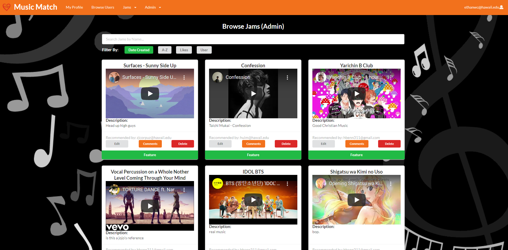

# Table of Contents
- [Overview](#overview)
- [Approach](#approach)
- [Deployment](#deployment)
- [User Interface](#user-interface)
- [Development History](#development-history)
- [Meet the Developers](#meet-the-developers)

# Overview

### The Problem
Many UH students have musical talents, but there is no easy way for them to find others with similar tastes and compatible musical abilities. Thus, they cannot experience the fun of informal jam sessions which could progress into performing musical groups.

### The Solution
The [Music Match](https://github.com/music-match/music-match) application developed by [Music Match Inc.](https://github.com/music-match) allows students to login and create a profile indicating their musical tastes, their musical capabilities, and their musical goals (from occasional, informal jam sessions to performing bands). Users can share their own jam sessions through Youtube links to a Youtube video to their own jam.

# Approach
Once a profile is created, others can browse the profiles filtered by specific tastes, capabilities, and goals to find compatible musicians to contact.

Students can also set up notifications to find out automatically when a profile is created that satisfies criteria that they specify.

Admins can monitor the site for inappropriate content, and create new categories of musical tastes, capabilities, and goals.

Some mockup pages include:
- Landing Page
- User home Page
- About Us Page
- User profile Page
- Edit Profile Page
- Browse Jams by other users
- Browse users by name or musical interests.

# Deployment

The [Music Match Website](http://143.198.236.70/) is available live!

# Developer Guide

## Installation
- First, [install meteor](https://www.meteor.com/developers/install).
- Second, download the [Music Match Repo](https://github.com/music-match/music-match) into your local system.
- Third, open a terminal and navigate into the music-match/app directory.
- Fourth, install the required meteor libraries by typing the following into the terminal:

```
$ meteor npm install
```

## Running the Application
- Upon completion of the installation process, ensure you are still in the music-match/app directory and enter the following into the terminal:

```
$ meteor npm run start
```

- If this is your first time starting the application, it will create the default data. This should be the output:

```
=> Started proxy.
=> Started MongoDB.
W20210424-15:39:27.766(-10)? (STDERR) Note: you are using a pure-JavaScript implementation of bcrypt.
W20210424-15:39:27.867(-10)? (STDERR) While this implementation will work correctly, it is known to be
W20210424-15:39:27.867(-10)? (STDERR) approximately three times slower than the native implementation.
W20210424-15:39:27.867(-10)? (STDERR) In order to use the native implementation instead, run
W20210424-15:39:27.867(-10)? (STDERR) 
W20210424-15:39:27.868(-10)? (STDERR)   meteor npm install --save bcrypt
W20210424-15:39:27.868(-10)? (STDERR) 
W20210424-15:39:27.868(-10)? (STDERR) in the root directory of your application.
I20210424-15:39:28.646(-10)? Creating the default user(s)
I20210424-15:39:28.646(-10)?   Creating user ethanwc@hawaii.edu.
I20210424-15:39:28.818(-10)?   Creating user garcia77@hawaii.edu.
I20210424-15:39:28.968(-10)?   Creating user icce@hawaii.edu.
I20210424-15:39:29.115(-10)?   Creating user ajp808@hawaii.edu.
I20210424-15:39:29.263(-10)?   Creating user john@foo.com.
I20210424-15:39:29.430(-10)? Creating default profiles.
I20210424-15:39:29.430(-10)?   Adding: Philip Johnson (john@foo.com)
I20210424-15:39:29.434(-10)?   Adding: Ethan Chee (ethanwc@hawaii.edu)
I20210424-15:39:29.436(-10)?   Adding: Preston Garcia (garcia77@hawaii.edu)
I20210424-15:39:29.437(-10)?   Adding: Isaiah Eusebio (icce@hawaii.edu)
I20210424-15:39:29.438(-10)?   Adding: Adam Parrilla (ajp808@hawaii.edu)
I20210424-15:39:29.440(-10)? Creating default Music Interests.
I20210424-15:39:29.453(-10)? Creating default Jams.
I20210424-15:39:29.468(-10)? Creating default Featured Jam.
I20210424-15:39:29.477(-10)? Creating list of Possible interests.
I20210424-15:39:29.533(-10)? Monti APM: completed instrumenting the app
=> Started your app.

=> App running at: http://localhost:3000/
   Type Control-C twice to stop.
   
```
Ignore “bcrypt warning”: Bcrypt is used for password checking and it is safe to ignore the warning during development stages.

- You can now open up your app on a webpage at: [http://localhost:3000/](http://localhost:3000/)
- To reset the app, exit meteor by pressing Control-C into the terminal, and type:

```
$ meteor reset
```

# User Interface
These will be the mockup pages that will be used as a basis for this final project.

## Landing Page


Upon entering the site, the user has the ability to:
- Login to their previously created account
- Register and create a new account
- Visit the About Us Page
- View the News and Events of the website
- Watch the Featured Jam 

## Create Profile Page


When a new user registers an account, they will be redirected to create their profile. New users must finish creating their profile before gaining access to the entirety of the site.

At the minimum, new users must enter information in the required fields:
- Name
- Image URL
- Goals
- Music Skill Level

If the user does not fill out any required fields, an error message appears upon clicking the Submit button.

## User Home Page

The first variation of the home page involves an existing profile for the logged in user. A preview of this page is shown below:


Upon logging in, the user has the ability to:
- Do anything from the landing page
- View their [own profile](#profile-page)
- Visit the [Browse Users page](#browsing-users)
- View [all the jams](#browsing-jams) shared by other users, view [own jams](#my-jams) they shared, and [create new jams](#create-jams)
- If the user is an admin, they will be able to navigate to the admin pages: [Browse Users (Admin)](#browse-users-admin-page) and [Browse Jams (Admin)](#browse-jams-admin-page)

The second variation of the home page is only displayed when a user logs in with no profile setup in the system. A preview of this page is shown below:

Typically, this page is only seen if the user recently registered an account or if their profile was deleted by an admin.

Upon logging in, the user has the ability to:
- Do anything from the landing page
- Visit the [Create Profile page](#create-profile-page)

## Profile Page


This page will be an exploded version of a single user, containing more information such as:
- Name
- Physical Address
- Phone
- Email Address
- Goals
- Instruments that they play
- Music Interests
- Music Skill Level

If the profile belongs to the user logged in, they will be able to:
- Edit their Profile
- Delete their Profile. There will be a secondary confirmation before deleting a profile.

## Edit Profile Page


This will edit the profile information for a user, which contain edit fields for:
- Name
- Physical Address (optional)
- Phone (optional)
- Image URL
- Goals
- Instruments that they play
- Music Interests
- Music Skill level

## Browse Users Page
The Browse Users page allows users to view a snapshot of other user profiles and easily search for users by name or music interest.


User profiles are displayed on cards that contain the following information:
- Name
- Email address
- Goals
- Music Interests
- Profile picture
- "View Profile" button

The "View Profile" button takes the user to the profile page of the card it was clicked on. This page is similar to the [My Profile](#profile-page) page except that the user cannot edit or delete the profile if they are not the owner.

Users can search for other profiles by typing a name or music interest in the search bar. The page will automatically display profiles that adhere to the criteria specified by the search bar.

## Browse Jams Page
The Browse Jams page allows users to view jams posted by other users and easily search for jams by title or description.


Jams are displayed on cards that contain the following information:
- Title
- Embedded YouTube video
- Descripton
- Owner of the jam

Upon clicking on the owner of the jam in the "Recommended By" section, the user will be redirected to the owner's profile page. This page is similar to the [My Profile](#profile-page) page except that the user cannot edit or delete the profile if they are not the owner.

Users can search for other jams by typing the title or description of the jam in the search bar. The page will automatically display jams that adhere to the criteria specified by the search bar.

## My Jams Page


This page will contain a list of jams created from your account, with an option to edit each of the jams. Each jam will have a:
- Title
- Youtube video
- Description

## Create Jams Page


This will allow you to create a jam, which requires the three fields for a jam:
- Title
- Youtube Video ID
- Description

## Browse Users Admin Page


In this page, admin users have the ability to:
- View all Profiles
- Edit and Delete Profiles

## Browse Jams Admin Page


In this page, admin users have the ability to:
- View all Jams
- Edit and Delete Jams
- Change the Featured Jam to be Displayed in Landing

## About Us Page

This page is in development.

# Development History

- Goals of [Milestone 1](https://github.com/music-match/music-match/projects/1): Create Mockup Pages, start Front-End Development, and Initial Deployment
- Goals of [Milestone 2](https://github.com/music-match/music-match/projects/2): Significantly improve functionality of app, continue Front-End Development

# Meet the Developers

- [Preston Garcia](https://prestontgarcia.github.io/)
	- In this project, I hope to experience working with a team while following the agile project management model. I also hope to hone my frontend and backend website development skills through the creation of our website.
- [Ethan Chee](https://ethancheez.github.io/)
	-  I would like to be able to design a website from scratch quickly, containing many features and user interfaces.
- [Isaiah Eusebio](https://icce2k.github.io/)
	-  I would like to gain more experience in app development and working with Meteor and React. Also, I would like to develop my teamwork and project management skills. 
- [Adam Parrilla](https://adamjparrilla.github.io/)
	- I’d like to work on adapting web designs to use the things we’ve learned to create a website. I’d also like to gain experience working with a group to design a project and expand my portfolio. 

