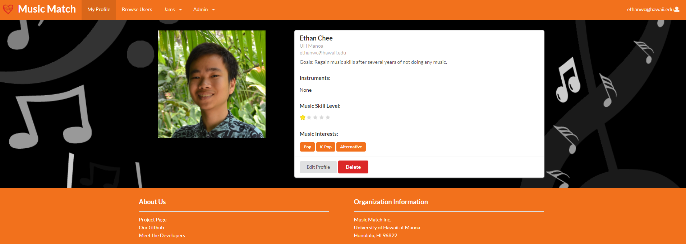
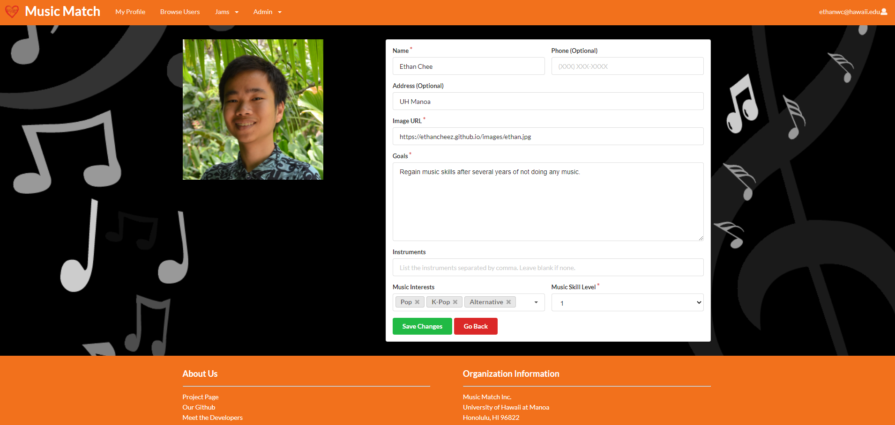
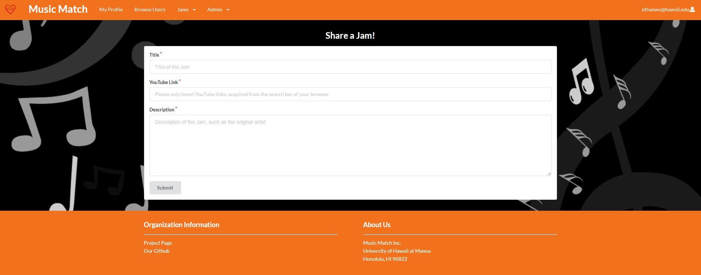

# Table of Contents
- [Overview](#overview)
- [Approach](#approach)
- [Deployment](#deployment)
- [User Interface](#user-interface)
- [Development History](#development-history)
- [Meet the Developers](#meet-the-developers)

# Overview

### The Problem
Many UH students have musical talents, but there is no easy way for them to find others with similar tastes and compatible musical abilities. Thus, they cannot experience the fun of informal jam sessions which could progress into performing musical groups.

### The Solution
The [Music Match](https://github.com/music-match/music-match) application allows students to login and create a profile indicating their musical tastes, their musical capabilities, and their musical goals (from occasional, informal jam sessions to performing bands). The profile can also include links to YouTube videos or SoundCloud tracks with examples of their musicianship.

# Approach
Once a profile is created, others can browse the profiles filtered by specific tastes, capabilities, and goals to find compatible musicians to contact.

Students can also set up notifications to find out automatically when a profile is created that satisfies criteria that they specify.

Admins can monitor the site for inappropriate content, and create new categories of musical tastes, capabilities, and goals.

Some mockup pages include:
- Landing page
- User home page
- Admin home page
- User profile page.
- Browse users by taste, ability, instrument, goals, etc.

# Deployment

[Music Match](http://143.198.236.70/) is available live!

# User Interface
These will be the mockup pages that will be used as a basis for this final project.

## Landing Page

Upon entering the site, the user has the ability to:
- Create Profile and Login
- Network with Musicians
- Browse by Interests
- Watch the jam that was chosen to be featured on the home page

## User Home Page

Upon logging in, the user has the ability to:
- View Own Profile
- Browse Users
- Browse Jams
- Watch the jam that was chosen to be featured on the home page

## Browsing Users

The page will contain:
- Cards for every user
- Search bar filtering users by category

This page will contain profile cards for every user containing the following information:
- Name
- Music Interests
- Goals
- "View Profile" Button

## Browsing Jams

This page will contain:
- Cards for jams created
- Links to the creators of the jams

## Profile Page

This page will be an exploded version of a single user, containing more information such as:
- Name
- Music Interests
- Instruments that they play
- Skill Level
- Goals
- Location
- Contact Information

If the profile belongs to the user logged in, they will be able to:
- View their own Profile
- Edit their Profile

## My Jams

This page will contain a list of jams created from your account, with an option to edit each of the jams. Each jam will have a:
- Title
- Youtube video
- Description

## Edit Profile

This will edit the information for a user, which contain edit fields for:
- Name
- Image URL
- Music Interests
- Goals
- Location
- Instruments Played
- Contact Information
- Skill level

## Create Jams

This will allow you to create a jam, which requires the three fields for a jam:
- Title
- Youtube Video ID
- Description

## Admin Page

In this page, admin users have the ability to:
- View all Profiles
- Edit and Delete Profiles

# Development History

- Goals of [Milestone 1](https://github.com/music-match/music-match/projects/1): Create Mockup Pages, start Front-End Development, and Initial Deployment
- Goals of [Milestone 2](https://github.com/music-match/music-match/projects/2): Significantly improve functionality of app, continue Front-End Development

# Meet the Developers

- [Preston Garcia](https://prestontgarcia.github.io/)
	- In this project, I hope to experience working with a team while following the agile project management model. I also hope to hone my frontend and backend website development skills through the creation of our website.
- [Ethan Chee](https://ethancheez.github.io/)
	-  I would like to be able to design a website from scratch quickly, containing many features and user interfaces.
- [Isaiah Eusebio](https://icce2k.github.io/)
	-  I would like to gain more experience in app development and working with Meteor and React. Also, I would like to develop my teamwork and project management skills. 
- [Adam Parrilla](https://adamjparrilla.github.io/)
	- I’d like to work on adapting web designs to use the things we’ve learned to create a website. I’d also like to gain experience working with a group to design a project and expand my portfolio. 

